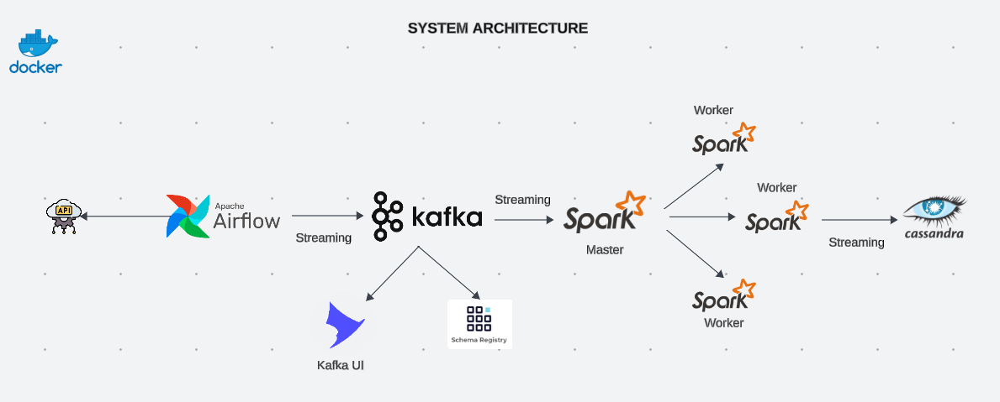
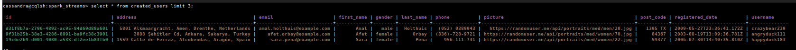

# Realtime Data Streaming Project

## Introduction

This project I was inspired by the project "https://github.com/airscholar/e2e-data-engineering" of "https://github.com/airscholar" - **Youtube**: [CodeWithYu](https://www.youtube.com/@CodeWithYu).

With `docker-compose.yml` and `Dockerfile` built by me, I want to try this project in my environment with anothor updates.

## Technologies

* **Apache Kafka**
* **Apache Spark**
* **Apache Airflow**
* **Cassandra**
* **Docker**
* **Python**
* **Another Services:** Debezium, Minio S3, MongoDB, PostgreSQL, PySpark

## System Architecture


## Setup and Install
With `Dockerfile`, `docker-compose.yml` file, build and run the containers using Docker Compose:
```bash
docker-compose up -d --build
```
## Usage
- Airflow web UI: `localhost:8080`
- Kafka-UI: `localhost:8085`
- Spark-master UI: `localhost:9090`
- Minio UI: `localhost:9000`
- Navigate to the project directory:
```bash
docker exec -it [airflow-container-id] bash
```
Check `/jars` directory: 
```bash
cd ..
ls spark/jars
```
Run using `spark-submit`:
```bash
cd --
cd /opt/airflow/jobs/python
spark-submit --master spark://spark-master:7077 spark_stream.py
```
Run using `jupyter-notebook`, follow these steps: 
1. Check logs **PySpark** service, open URLs "http://127.0.0.1:8888/lab?token=***"
2. Copy and run cells in `jobs/python/jupyter_notebook/stream.ipynb` 

After turn on `kafka_stream.py` DAG, check data in Cassandra:
```bash
docker exec -it [Cassandra-container-id] bash
```
```bash
cqlsh --username cassandra --password cassandra
```
```bash
DESCRIBE KEYSPACES;
USE spark_streams;
SELECT * FROM spark_streams.created_users;
```
Result:
